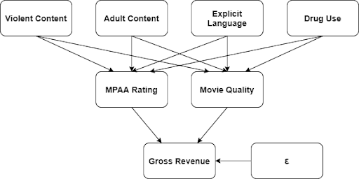

```{r setup, include=FALSE}
knitr::opts_chunk$set(echo = TRUE)

MIN_REVENUE = 10000000
MIN_BUDGET = 10000

library(gridExtra)
library(tidyverse)
library(magrittr)
library(ggplot2)
library(hash)

data <- read.csv(file = "movies.csv")
```

## 1. Introduction

### 1a. Research Question

|   Acme Studios has spent a $50,000,000.00 budget on a superhero movie, and the director insists that it includes a scene where the main villain goes on an expletive-laden tirade. We know that including this scene will mean that our movie is rated R, and cutting the scene will result in the movie being rated PG-13. The director is extremely upset that we want to cut the scene and says we're ruining the film's artistic integrity by trying to make editorial changes after the director's cut. So upset that he went directly to the studio head to complain. Now Acme Studios’ executive team has to decide: do they modify the movie for a more family-friendly rating, or do they respect the director's wishes and release it as-is? As data scientists, we would have difficulty quantifying artistic integrity or the value of the relationship between the studio and the director. Still, we feel strongly that we can show the relationship between worldwide revenue for a PG-13 vs. R ratings (holding all other variables constant). The studio head wants to know: How much more money do they expect to make by defying the director's wishes and cutting the movie to make it PG-13?

### 1c. Causal Theory


{width=60%}

Our research question seeks to measure the impact of the MPAA rating (more specifically, PG-13 versus R) on the gross box office revenue. A movie typically receives an R rating by the MPAA for some combination of violent content, adult content, explicit language, and drug use. In addition to these factors contributing to the MPAA rating, they also contribute to the quality of the movie. We expect to show that both MPAA rating and movie quality impact the gross revenue of the film. By adjusting the movie's content to secure the desired rating, we may also affect the quality of the movie. Therefore, we want to explore models that include a proxy for movie quality to attempt to minimize omitted variable bias.


## 2. A description of the Data and Research Design


After you have presented the introduction and the concepts that are under investigation, what data are you going to use to answer the questions? What type of research design are you using? What type of models are you going to estimate, and what goals do you have for these models?  

### 2a. A Model Building Process

You will next build a set of models to investigate your research question, documenting your decisions. Here are some things to keep in mind during your model building process:

1. *What do you want to measure*? Make sure you identify one, or a few, variables that will allow you to derive conclusions relevant to your research question, and include those variables in all model specifications. How are the variables that you will be modeling distributed? Provide enough context and information about your data for your audience to understand whatever model results you will eventually present. 
2. What [covariates](https://en.wikipedia.org/wiki/Dependent_and_independent_variables#Statistics_synonyms) help you achieve your modeling goals? Are there problematic covariates?  either due to *collinearity*, or because they will absorb some of a causal effect you want to measure?
3. What *transformations*, if any, should you apply to each variable? These transformations might reveal linearities in the data, make our results relevant, or help us meet model assumptions.
4. Are your choices supported by exploratory data analysis (*EDA*)? You will likely start with some general EDA to *detect anomalies* (missing values, top-coded variables, etc.). From then on, your EDA should be interspersed with your model building. Use visual tools to *guide* your decisions. You can also leverage statistical *tests* to help assess whether variables, or groups of variables, are improving model fit.

At the same time, it is important to remember that you are not trying to create one perfect model. You will create several specifications, giving the reader a sense of how robust (or sensitive) your results are to modeling choices, and to show that you're not just cherry-picking the specification that leads to the largest effects.

At a minimum, you need to estimate at least three model specifications: 

The first model you include should include *only the key variables* you want to measure. These variables might be transformed, as determined by your EDA, but the model should include the absolute minimum number of covariates (usually zero or one covariate that is so crucial it would be unreasonable to omit it).

Additional models should each be defensible, and should continue to tell the story of how product features contribute to product success. This might mean including additional right-hand side features to remove omitted variable bias identified by your casual theory; or, instead, it might mean estimating a model that examines a related concept of success, or a model that investigates a heterogeneous effect. These models, and your modeling process should be defensible, incremental, and clearly explained at all points.

Your goal is to choose models that encircle the space of reasonable modeling choices, and to give an overall understanding of how these choices impact results.

```{r Data Cleaning}

# Retrieve only the needed columns

df = select(data, c('gross', 'budget', 'score', 'genre', 'runtime', 'rating'))

# Remove world_revenue under MIN_REVENUE
df <- subset(df, df$gross >= MIN_REVENUE & !is.na(df$gross))

# Remove budget under MIN_BUDGET
df <- subset(df, df$budget >= MIN_BUDGET & !is.na(df$budget))

# Keep G, PG, PG-13, R, X
df <- subset(df,
             df$rating == "G"
             | df$rating == "PG"
             | df$rating == "PG-13"
             | df$rating == "R"
             | df$rating == "X")

# Apply Indicator variable for PG-13 (G and PG is the base case)
df$PG_13 = factor(ifelse(df$rating == "PG-13" , 1, 0))

# Apply Indicator variable for R and X (G and PG is the base case)
df$R_OVER = factor(ifelse(df$rating == "R" | df$rating == "X", 1, 0))


df %>%
  ggplot(aes(x=log(budget), y=log(gross), color=rating)) +
  geom_point()

```


## 4. A Results Section

You should display all of your model specifications in a regression table, using a package like [`stargazer`](https://cran.r-project.org/web/packages/stargazer/vignettes/stargazer.pdf) to format your output. It should be easy for the reader to find the coefficients that represent key effects near the top of the regression table, and scan horizontally to see how they change from specification to specification. Make sure that you display the most appropriate standard errors in your table.

In your text, comment on both *statistical significance and practical significance*. You may want to include statistical tests besides the standard t-tests for regression coefficients. Here, it is important that you make clear to your audience the practical significance of any model results. How should the product change as a result of what you have discovered? Are there limits to how much change you are proposing? What are the most important results that you have discovered, and what are the least important? 

## 5. Limitations of your Model 

### 5a. Statistical limitations of your model

As a team, evaluate all of the large sample model assumptions. However, you do not necessarily want to discuss every assumption in your report. Instead, highlight any assumption that might pose significant problems for your analysis. For any violations that you identify, describe the statistical consequences. If you are able to identify any strategies to mitigate the consequences, explain these strategies. 

Note that you may need to change your model specifications in response to violations of the large sample model. 

### 5b. Structural limitations of your model

What are the most important *omitted variables* that you were not able to measure and include in your analysis? For each variable you name, you should *reason about the direction of bias* caused by omitting this variable and whether the omission of this variable calls into question the core results you are reporting. What data could you collect that would resolve any omitted variables bias? 

## 7. Conclusion

Make sure that you end your report with a discussion that distills key insights from your estimates and addresses your research question. 

