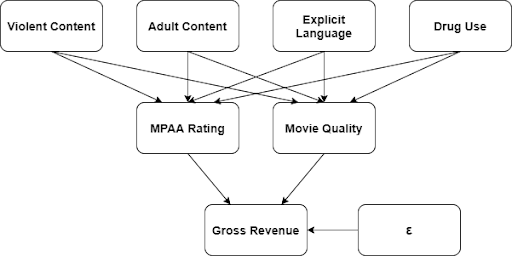

```{r - Setup, include=FALSE}
knitr::opts_chunk$set(echo = FALSE)

MIN_REVENUE = 1
MIN_BUDGET = 1

library(gridExtra)
library(tidyverse)
library(magrittr)
library(ggplot2)
library(hash)
library(lmtest)
library(sandwich)
library(stargazer)
library(hash)
library(caTools)
library(GGally)

data <- read.csv(file = "../data/movies.csv")
cpi <- read.csv(file = "../data/CPI_by_Year.csv")
```

## 1. Introduction

### 1a. Context

> Acme Studios has spent a $50,000,000.00 budget on a superhero movie, and the director insists that the movie should include a scene where the main villain goes on an expletive-laden tirade. We know that including this scene will mean that the movie will be rated R, and cutting the scene will result in the movie being rated PG-13. The director is extremely upset that we want to cut the scene and says we're ruining the film's artistic integrity by trying to make editorial changes after the director's cut. So upset that he went directly to the studio head to complain. Now Acme Studios’ executive team has to decide: do they modify the movie for a more family-friendly rating, or do they respect the director's wishes and release it as-is? As data scientists, we would have difficulty quantifying artistic integrity or the value of the relationship between the studio and the director. Still, we feel strongly that we can show the relationship between worldwide revenue for a PG-13 vs. R ratings (holding all other variables constant). The studio head wants to know: How much more money do they expect to make by defying the director's wishes and cutting the movie to make it PG-13?

### 1b. Research Question

>   *Holding other factors constant, how much more money should a movie studio expect to make on a film that gets a PG-13 rating instead of an R rating from the MPAA?*

>   Our research question intends to measure the impact *MPAA Rating* and *Movie Quality* on the *Gross Revenue* that it will generate. Given other available, quantifiable factors like the *Budget*, *Genre*, and *Runtime*, this study also intends to investigate if they affect the *MPAA Rating* and/or *Movie Quality* which in-turn affect the *Gross Revenue*. 

### 1c. Causal Theory

{width=60%}


>   Our research question seeks to measure the impact of the *MPAA Rating* (more specifically, PG-13 versus R) on the *Gross box office revenue*. A movie typically receives an R rating by the MPAA for some combination of violent content, adult content, explicit language, and drug use. In addition to these factors contributing to the MPAA rating, they also contribute to the quality of the movie. We expect to show that both MPAA rating and movie quality impact the gross revenue of the film. By adjusting the movie's content to secure the desired rating, we may also affect the quality of the movie. Therefore, this study will explore models that include a proxy for movie quality to attempt to minimize omitted variable bias.

## 2. Research Design and Data

After you have presented the introduction and the concepts that are under investigation, what data are you going to use to answer the questions? What type of research design are you using? What type of models are you going to estimate, and what goals do you have for these models?

### 2a. Data Source

>   The data used for this study is a movie dataset from Kaggle (https://www.kaggle.com/danielgrijalvas/movies). It contains 7512 unique movie titles ranging from the year 1986 to 2020. According to the description of the creator of the dataset, the data was scraped from IMDb.com so the extent of the movie title coverage can go as far as the available information posted on the IMBd website. Below are the important columns that were considered for this study:

* Outcome Variable
    + `gross`   : Revenue of the movie in USD
\
* Explanatory Variables
    + `score`   : Average IMDb user rating
    + `rating`  : MPAA rating of the movie (R, PG, etc.)
    + `runtime` : Length of movie in minutes
    + `budget`  : Budget of the movie in USD
    + `votes`   : Number of user votes on the IMBd website
    
### 2b. Research Design

>   Using the data and variables above, this study measured the impact *MPAA Rating* and *Movie Quality* on the *Gross Revenue* that a movie will generate. Causal models were generated using the logic from the causal theory in 1c. `gross` is the main quantified success variable. According to the causal theory, two main explanatory quantities were included in the model. `rating` was used to quantify the MPAA rating of the film while `score` is the main quantified measurement of quality. `budget` and `runtime` both affect the the movie quality, but not the `rating` so they were considered as proxies for quality.

>   The outcome of interest is `gross`, the revenue of the movie in USD. This is the main outcome variable of all the causal models and is quantified in numeric form as is.

>   In order to properly quantify `rating` in the model, indicator variables were used. The data was divided into two (2) categories: PG-13, and R. All movies rated PG-13 were given a separate indicator variable (`PG13`) while all movies rated R were treated as the base-case.

>   Measuring movie quality is primarily measured by the `score` variable. Variables like `budget` and `runtime` also have an effect on quality so they were considered as possible proxies for quality in the causal models.

>   In order to remove duplicate movie titles, the data point with the larger budget was retained. If both the budgets and titles were equal, the data point with the larger revenue was retained.

>   Because our dataset covers a period of 50 years, we are applying a CPI-based price adjustment to each monetary variable to account for inflation. The inflation-adjusted valuse (in 2020 dollars) will be represented with the 'adj_gross' and 'adj_budget' variables.

>   The filtered dataset was used to produce multiple linear models and evaluate them using coefficient tests in R. Stargazer was used to compared the models to determine which model best aligns with the data and our causal theory. Armed with this chosen model, its predictions were evaluated to check how well the model is able to predict the revenue based on the input parameters. Finally, the model was applied to the specific case outlined in the overview section above to predict the revenue for both a PG-13 and R MPAA rating case.

### 2c. Data Cleaning
>   Removed entries with budget under `r MIN_BUDGET` or gross revenue under `r MIN_REVENUE` to filter out small-scale releases that do not fit the mold of the type of movie we want to measure.

>   Removed entries that were not rated PG-13 or R.

>   Removed duplicate entries as discussed in the previous section.

>   Created indicator variable for PG-13 rating.

>   Created CPI-adjusted variables for gross revenue and budget.


```{r Data Cleaning}
# Retrieve only the needed columns
df_raw = select(data, c('title', 'gross', 'budget', 'score', 'runtime', 'rating', 'year', 'votes'))

# Remove data points with world_revenue under MIN_REVENUE
df_raw <- subset(df_raw, df_raw$gross >= MIN_REVENUE & !is.na(df_raw$gross))

# Remove data points with budget under MIN_BUDGET
df_raw <- subset(df_raw, df_raw$budget >= MIN_BUDGET & !is.na(df_raw$budget))

# Keep PG-13 and R data points
df_raw <- subset(df_raw, df_raw$rating == "PG-13" | df_raw$rating == "R")

# Remove Duplicate Movie Titles
# Hash object for title : budget
h <- hash() 

# Clean dataframe
df = data.frame()

for(i in 1:nrow(df_raw)) {       # for-loop over rows
  title_key = df_raw[i,'title']
  
  if (TRUE == all(has.key( title_key, h ))) {
    # Title is already recorded

    # Search for existing row in clean dataframe with the same title
    for (k in 1:nrow(df)) {
      
      if (title_key == df[k,'title']) {
        # Replace row if the budget of the new value is higher than that of the
        # budget of the recorded title
        if (df_raw[i, 'budget'] > df[k, 'budget']) {
          
          # Delete found row in cleaned dataframe
          df = df[-c(k),]
          
          # Bind raw dataframe row to clean dataframe
          df <- rbind(df, df_raw[i,])
          
          # Revise title_key and budget to hash
          h[[title_key]] = df_raw[i,'budget']
        } else if (df_raw[i, 'budget'] > df[k, 'budget']
                   & df_raw[i, 'gross'] > df[k, 'gross']) {
          # Delete found row in cleaned dataframe
          df = df[-c(k),]
          
          # Bind raw dataframe row to clean dataframe
          df <- rbind(df, df_raw[i,])
          
          # Revise title_key and budget to hash
          h[[title_key]] = df_raw[i,'budget']
        }
        break
      }
      
    }
    
  } else {
    # Add title_key and budget to hash
    h[[title_key]] = df_raw[i,'budget']
    
    # Bind raw dataframe row to clean dataframe
    df <- rbind(df, df_raw[i,])
  }
}

# Apply Indicator variable for PG-13 (R is the base case)
df$PG13 = factor(ifelse(df$rating == "PG-13" , 1, 0))

# Perform CPI adjustment to both gross and budget variables.
df <- merge(x = df, y = cpi, by= 'year')
df <- transform(df, adj_gross = gross * adjust_to_2020_dollars, adj_budget = budget * adjust_to_2020_dollars)
```

### 2d. Exploratory Data Analysis

>   There are `r nrow(df)` unique titles considered for this study.

```{r - EDA: Check main financial variables}
gross_histogram <- df %>%
  ggplot(aes(adj_gross)) +
  geom_histogram(bins=30)

log_gross_histogram <- df %>%
  ggplot(aes(log(adj_gross))) +
  geom_histogram(bins=30)

budget_histogram <- df %>%
  ggplot(aes(adj_budget)) +
  geom_histogram(bins=30)

log_budget_histogram <- df %>%
  ggplot(aes(log(adj_budget))) +
  geom_histogram(bins=30)

grid.arrange(gross_histogram, log_gross_histogram,
             budget_histogram, log_budget_histogram,
             nrow = 2, ncol = 2, top = "Financial Variable distributions")

```


```{r - EDA: Check other explanatory variables, warning=FALSE}
# CHECK OTHER EXPLANATORY VARIABLES

df$ratings_distribution = factor(ifelse(df$rating == "R", "R", ifelse(df$rating == "PG-13", "PG-13", "G/PG")))

ratings_distribution_histogram <- df %>%
  ggplot(aes(x=ratings_distribution)) +
  geom_bar() +
  theme(legend.position = "none")

score_histogram <- df %>%
  ggplot(aes(score)) +
  geom_histogram(bins=30)

year_histogram <- df %>%
  ggplot(aes(year)) +
  geom_histogram(bins=10)

votes_histogram <- df %>%
  ggplot(aes(votes)) +
  geom_histogram(bins=30)

log_votes_histogram <- df %>%
  ggplot(aes(log(votes))) +
  geom_histogram(bins=30)

runtime_histogram <- df %>%
  ggplot(aes(runtime)) +
  geom_histogram(bins=30)

grid.arrange(ratings_distribution_histogram, score_histogram,  
             votes_histogram, log_votes_histogram,
             runtime_histogram, year_histogram,
             nrow = 3, ncol = 2, top = "Explanatory Variable Distributions")
```

>   There doesn't seem to be a strong correlation between the year and revenue of the movie. So it might not be necessary to adjust the `gross` data for inflation.

```{r - Evaluate numeric variables for perfect collinearity, message = FALSE, warning = FALSE, error = FALSE}

df_collinearity = select(df, c('adj_gross', 'adj_budget', 'score', 'runtime', 'year', 'votes'))

# Log-Transform `adj_gross`, `adj_budget`, and `votes`
df_collinearity$log_adj_gross = log(df_collinearity$adj_gross)
df_collinearity$log_adj_budget = log(df_collinearity$adj_budget)
df_collinearity$log_votes = log(df_collinearity$votes)

# Remove `gross`, `budget`, and `votes`
df_collinearity = select(df_collinearity, c('log_adj_gross', 'log_adj_budget', 'score', 'runtime', 'year', 'log_votes'))

# check for collinearity
ggpairs(df_collinearity)
```

>   According to the correlation plots above, the explanatory variables do not seem to have any strong correlation to each other. The log-transformed data for `adj_budget` and `votes` may have decent correlation with the log-transformed data for `adj_gross` (the outcome variable), but this should not produce any problems for finding an BLP for this data.


## 3. Analysis

### 3a. A Model Building Process

You will next build a set of models to investigate your research question, documenting your decisions. Here are some things to keep in mind during your model building process:

1. *What do you want to measure*? Make sure you identify one, or a few, variables that will allow you to derive conclusions relevant to your research question, and include those variables in all model specifications. How are the variables that you will be modeling distributed? Provide enough context and information about your data for your audience to understand whatever model results you will eventually present. 
2. What [covariates](https://en.wikipedia.org/wiki/Dependent_and_independent_variables#Statistics_synonyms) help you achieve your modeling goals? Are there problematic covariates?  either due to *collinearity*, or because they will absorb some of a causal effect you want to measure?
3. What *transformations*, if any, should you apply to each variable? These transformations might reveal linearities in the data, make our results relevant, or help us meet model assumptions.
4. Are your choices supported by exploratory data analysis (*EDA*)? You will likely start with some general EDA to *detect anomalies* (missing values, top-coded variables, etc.). From then on, your EDA should be interspersed with your model building. Use visual tools to *guide* your decisions. You can also leverage statistical *tests* to help assess whether variables, or groups of variables, are improving model fit.

At the same time, it is important to remember that you are not trying to create one perfect model. You will create several specifications, giving the reader a sense of how robust (or sensitive) your results are to modeling choices, and to show that you're not just cherry-picking the specification that leads to the largest effects.

At a minimum, you need to estimate at least three model specifications: 

The first model you include should include *only the key variables* you want to measure. These variables might be transformed, as determined by your EDA, but the model should include the absolute minimum number of covariates (usually zero or one covariate that is so crucial it would be unreasonable to omit it).

Additional models should each be defensible, and should continue to tell the story of how product features contribute to product success. This might mean including additional right-hand side features to remove omitted variable bias identified by your casual theory; or, instead, it might mean estimating a model that examines a related concept of success, or a model that investigates a heterogeneous effect. These models, and your modeling process should be defensible, incremental, and clearly explained at all points.

Your goal is to choose models that encircle the space of reasonable modeling choices, and to give an overall understanding of how these choices impact results.

Proposed Models:

(1) $$ ln(Adjusted Gross) = \beta_0 + \beta_1 * PG13 $$
(2) $$ ln(Adjusted Gross) = \beta_0 + \beta_1 * PG13 + \beta_2 * Score $$
(3) $$ ln(Adjusted Gross) = \beta_0 + \beta_1 * PG13 + \beta_2 * Score + \beta_3 * PG13 * Score $$
(4) $$ ln(Adjusted Gross) = \beta_0 + \beta_1 * PG13 + \beta_2 * Score + \beta_3 * ln(Adjusted Budget)$$
(5) $$ ln(Adjusted Gross) = \beta_0 + \beta_1 * PG13 + \beta_2 * Score + \beta_3 * PG13 * Score $$  
    $$ + \beta_4 * ln(Adjusted Budget) + \beta_5 * PG13 * ln(Adjusted Budget) $$
 
```{r - Create the models}

#Model 1: Rating Only
# Base Case - R Movies
model_1 = lm(log(adj_gross) ~ PG13, data = df)

#Model 2: Rating and Quality
# Base Case - R Movies with rating of 0
model_2 = lm(log(adj_gross) ~ PG13 + score, data = df)

#Model 3: Rating and Quality with interaction terms
model_3 = lm(log(adj_gross) ~ PG13 + score + PG13*score, data = df)

#Model 4: Rating and Quality with budget
model_4 = lm(log(adj_gross) ~ PG13 + score + log(adj_budget), data = df)

#Model 5: Rating and Quality with budget and interaction terms
model_5 = lm(log(adj_gross) ~ PG13 + score + PG13 * score + log(adj_budget) + log(adj_budget) * PG13, data = df)


stargazer(
  model_1, 
  model_2,
  model_3,
  model_4,
  model_5,
  type = 'text',
  header = FALSE, 
  star.cutoffs = c(0.05, 0.01, 0.001) # the default isn't in line with w203
)

```

```{r model score and rating}
# test
model_6 = lm(score ~ PG13, data = df)
summary(model_6)
```

```{r - Function to interpret coefficients}
level_to_log <- function(coeff) {
  # Inputs the coefficient of an untransformed variable
  # Returns the % change in the log-transformed outcome variable per unit increase in coeff
  return ((exp(coeff)-1)*100)
}

log_log_pct_change <- function(coeff, pct_change) {
  # Inputs the coefficient of an untransformed variable and the percent change
  # Returns the % change in the log-transformed outcome variable given the % increase in the log-transformed explanatory variable
  # Basis: https://medium.com/@kyawsawhtoon/log-transformation-purpose-and-interpretation-9444b4b049c9
  input_ratio = 1+(pct_change/100)
  output_ratio = input_ratio ^ coeff
  return ((output_ratio-1)*100)
}

```

>   In order to answer the research question, according to our causal theory, the two main factors that affect a movie's revenue that will be measured are *Quality* and *MPP Rating*. Other variables would either contribute to, or interact with, the two main factors.

>   Based on our EDA, log transformations of both the gross revenue (`gross`) and `budget` variables seemed helpful to produce a better-fitting linear model. This is because of the skewed nature of the data where both the financial variables have most data points toward zero with some extreme outliers (movies that generated a very large revenue). Other numeric variables did not seem to require any transformations because the distribution seemed symmetrical enough.

>   The first model (1) measures only the effect of changing the MPAA rating (PG-13 or R) on the gross revenue of the movie. $\beta_0$ is the estimated revenue that an R-rated movie is estimated to generate while $\beta_1$ is the estimated gain or in revenue if the movie is rated PG-13.

(1) $$ ln(Gross) = \beta_0 + \beta_1 * PG13 $$

```{r - model 1 Beta 0 interpretation}
# Expected revenue for R-rated movies
m1b0 = round(exp(summary(model_1)$coefficients[1]), digits = 2)
```

> Based on model (1) movies rated R are expected to generate $`r m1b0` in gross revenue (with no other factors).

```{r - model 1 Beta 1 interpretation}
# Expected increase in revenue for movies rated PG-13 over R 
m1b1 = round(level_to_log(summary(model_1)$coefficients[2]), digits = 2)
```

> Based on the same model, movies rated PG-13 are likely to generate `r m1b1`% more gross revenue than a movie rated R.

\
|   The second model (2) introduced the effect of a film's IMDb score on the gross revenue alongside the basic coefficients. $\beta_2$ indicates the estimated gain in revenue per increase in IMDb score. This model includes the variable for quality (`score`).

(2) $$ ln(Gross) = \beta_0 + \beta_1 * PG13 + \beta_2 * Score $$


```{r - model 2 Beta 0 interpretation}
# Expected revenue for R-rated movies
m2b0 = round(exp(summary(model_2)$coefficients[1]), digits = 2)
```

> Based on model (2) movies rated R are expected to generate $`r m2b0` in gross revenue (with no other factors).

```{r - model 2 Beta 1 interpretation}
# Expected increase in revenue for movies rated PG-13 over R 
m2b1 = round(level_to_log(summary(model_2)$coefficients[2]), digits = 2)
```

> Movies rated PG-13 are likely to generate `r m2b1`% more gross revenue than a movie rated R.

```{r - model 2 Beta 2 interpretation}
# Expected increase in revenue for movies rated PG-13 over R 
m2b2 = round(level_to_log(summary(model_2)$coefficients[3]), digits = 2)
```

> Movies are expected to generate `r m2b2`% more gross revenue per 1 point increase in score.

\
|   The third model (3) introduced the possible effect of the interaction of a film's IMDb score and rating on the gross revenue alongside the basic coefficients. $\beta_3$ indicates the estimated extra gain in revenue per increase in IMDb score if the movie is rated PG-13. The effect of $\beta_3$ would capture any interaction between the two main quantities and its effect on the movie's gorss revenue.

(3) $$ ln(Gross) = \beta_0 + \beta_1 * PG13 + \beta_2 * Score + \beta_3 * PG13 * Score $$

```{r model 3 Beta 0 interpretation}
m3b0 = round(exp(summary(model_3)$coefficients[1]), digits = 2)
```

> Based on model (3) movies rated R are expected to generate $`r m3b0` in gross revenue (with no other factors).

```{r model 3 Beta 1 interpretation}
m3b1 = round(level_to_log(summary(model_3)$coefficients[2]), digits = 2)
```

> Movies rated PG-13 are likely to generate `r m3b1`% more gross revenue than a movie rated R.

```{r model 3 Beta 2 interpretation}
m3b2 = round(level_to_log(summary(model_3)$coefficients[3]), digits = 2)
```

> Movies are expected to generate `r m3b2`% more gross revenue per 1 point increase in score.

```{r model 3 Beta 3 interpretation}
m3b3 = round(level_to_log(summary(model_3)$coefficients[4]), digits = 2)
```

> Movies rated R are expected to generate `r m3b3`% more gross revenue per 1 point increase in score than movies rated PG-13.

\
|   The fourth model (4) introduced the possible effect of a film's budget on the gross revenue alongside the basic coefficients for rating and score. $\beta_3$ indicates the estimated extra gain in revenue per increase in IMDb score if the movie is rated PG-13. Since it is a well-known fact that the budget is a big contributing factor in the quality and revenue of a movie, it was included to measure its effect on the gross revenue of a movie without any interactions.

(4) $$ ln(Gross) = \beta_0 + \beta_1 * PG13 + \beta_2 * Score + \beta_3 * ln(Budget)$$

```{r model 4 Beta 0 interpretation}
m4b0 = round(exp(summary(model_4)$coefficients[1]), digits = 2)
```

> Based on model (4) movies rated R are expected to generate a in $`r m4b0` in gross revenue (with no other factors).

```{r model 4 Beta 1 interpretation}
m4b1 = round(level_to_log(summary(model_4)$coefficients[2]), digits = 2)
```

> Movies rated PG-13 are likely to generate `r m4b1`% more gross revenue than a movie rated R.

```{r model 4 Beta 2 interpretation}
m4b2 = round(level_to_log(summary(model_4)$coefficients[3]), digits = 2)
```

> Movies are expected to generate `r m4b2`% more gross revenue per 1 point increase in score.

```{r model 4 Beta 3 interpretation}
m4b3 = round(log_log_pct_change(summary(model_4)$coefficients[4], 10), digits = 2)
```

> Movies are expected to generate `r m4b3`% more gross revenue if the budget is increased by 10%.

\
|   The fifth model (5) introduced the possible effect of the interaction of a film's IMDb score and rating as well as the interaction between MPAA rating and budget on the gross revenue alongside the basic coefficients. $\beta_3$ indicates the estimated extra gain in revenue per increase in IMDb score if the movie is rated PG-13. $\beta_4$ indicates the estimated extra gain in revenue per increase in IMDb score if the movie is rated PG-13. $\beta_5$ indicates the estimated extra gain in revenue per increase in budget if the movie is rated PG-13. In addition to testing for any significant effect of the interaction of quality (`score`) and rating, model (5) also tests to check if the effect if the changing rating changes the effect of budget on the film's revenue as well.

(5) $$ ln(Gross) = \beta_0 + \beta_1 * PG13 + \beta_2 * Score + \beta_3 * PG13 * Score  + \beta_4 * ln(Budget) + \beta_5 * PG13 * ln(Budget) $$

```{r model 5 Beta 0 interpretation}
m5b0 = round(exp(summary(model_5)$coefficients[1]), digits = 2)
```

> Based on model (5) movies rated R are expected to generate $`r m5b0` in gross revenue (with no other factors).

```{r model 5 Beta 1 interpretation}
m5b1 = round(level_to_log(summary(model_5)$coefficients[2]), digits = 2)
```

> Movies rated PG-13 are likely to generate `r m5b1`% more gross revenue than a movie rated R.

```{r model 5 Beta 2 interpretation}
m5b2 = round(level_to_log(summary(model_5)$coefficients[3]), digits = 2)
```

> Movies are expected to generate `r m5b2`% more gross revenue per 1 point increase in score.

```{r model 5 Beta 3 interpretation}
m5b3 = round(log_log_pct_change(summary(model_5)$coefficients[4], 10), digits = 2)
```

> Movies are expected to generate `r m5b3`% more gross revenue if the budget is increased by 10%.

```{r model 5 Beta 4 interpretation}
m5b4 = round(level_to_log(summary(model_5)$coefficients[5]), digits = 2)
```

> Movies rated PG-13 are expected to generate `r m5b4`% more gross revenue than movies rated R per 1 point increase in score.

```{r model 5 Beta 5 interpretation}
m5b5 = round(log_log_pct_change(summary(model_5)$coefficients[6], 10), digits = 2)
```

> Movies rated PG-13 are expected to generate `r m5b5`% more gross revenue than movies rated R if the budget is increased by 10%.


## 4. A Results Section

You should display all of your model specifications in a regression table, using a package like [`stargazer`](https://cran.r-project.org/web/packages/stargazer/vignettes/stargazer.pdf) to format your output. It should be easy for the reader to find the coefficients that represent key effects near the top of the regression table, and scan horizontally to see how they change from specification to specification. Make sure that you display the most appropriate standard errors in your table.

In your text, comment on both *statistical significance and practical significance*. You may want to include statistical tests besides the standard t-tests for regression coefficients. Here, it is important that you make clear to your audience the practical significance of any model results. How should the product change as a result of what you have discovered? Are there limits to how much change you are proposing? What are the most important results that you have discovered, and what are the least important? 

```{r - Model Table}
stargazer(
  model_1, 
  model_2,
  model_3,
  model_4,
  model_5,
  type = 'text', header = FALSE, 
  star.cutoffs = c(0.05, 0.01, 0.001) # the default isn't in line with w203
)

```

## 5. Limitations of your Model 

### 5a. Statistical limitations of your model

As a team, evaluate all of the large sample model assumptions. However, you do not necessarily want to discuss every assumption in your report. Instead, highlight any assumption that might pose significant problems for your analysis. For any violations that you identify, describe the statistical consequences. If you are able to identify any strategies to mitigate the consequences, explain these strategies. 

Note that you may need to change your model specifications in response to violations of the large sample model. 

### 5b. Structural limitations of your model

What are the most important *omitted variables* that you were not able to measure and include in your analysis? For each variable you name, you should *reason about the direction of bias* caused by omitting this variable and whether the omission of this variable calls into question the core results you are reporting. What data could you collect that would resolve any omitted variables bias? 

## 6. Conclusion

Make sure that you end your report with a discussion that distills key insights from your estimates and addresses your research question. 

